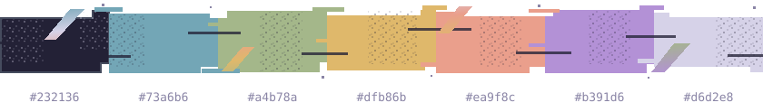
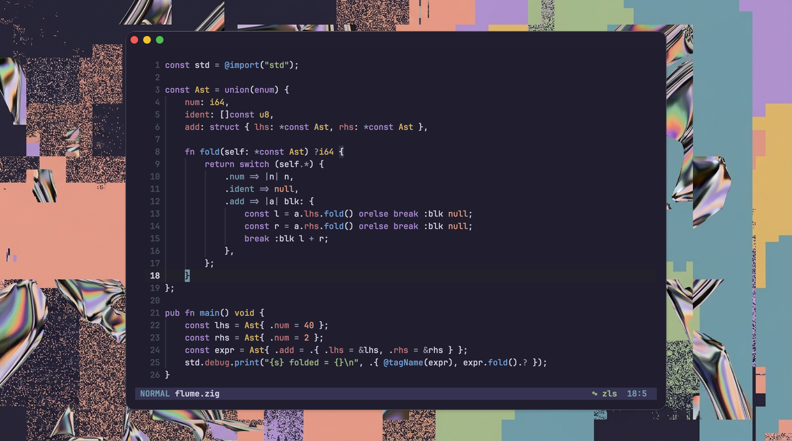

<div align="center">
  <h1>FLUME</h1>
  <p><strong>Organic synthesis. Soft contrast. Resonant code.</strong></p>
  <p>A dark Neovim theme tuned for quiet focus and warm spectral edges.</p>
  
  
  <p><sub>JetBrains Mono · Zig</sub></p>
</div>

## Design

Flume takes its name and visual direction from [Jonathan Zawada's artwork for
Flume](https://zawada.art/work/flume-skin/): organic forms meeting synthetic
surfaces, spectral color, and digital interruption. Kanagawa and Jellybeans
informed the palette's balance and long-session readability. One Dark syntax
highlighting influenced how colors are assigned across semantic code groups.

The theme builds on one quiet violet-dark foundation, with muted smoke blue,
moss, resin, coral, rose, and spectral violet assigned by semantic role. The
goal is color that gives code structure without making every token compete for
attention.

## Features

- Tree-sitter, LSP semantic tokens, diagnostics, terminal colors, and common plugins.
- Palette and highlight overrides, transparent mode, and syntax style hooks.
- Generated palette integrations for Ghostty, Tmux, LSD, Pi, and Tuxedo.
- One maintained dark palette and a fast reload workflow for theme development.

## Installation

Requires Neovim 0.9+ with true-color support:

```lua
vim.opt.termguicolors = true
```

Using `lazy.nvim`:

```lua
{
    "mitander/flume.nvim",
    lazy = false,
    priority = 1000,
    opts = {},
    config = function(_, opts)
        require("flume").setup(opts)
        vim.cmd.colorscheme("flume")
    end,
}
```

## Configuration

Defaults:

```lua
require("flume").setup({
    transparent = false,
    terminal_colors = true,
    overrides = {},
    highlights = {},
    styles = {
        comments = {},
        functions = {},
        keywords = {},
        strings = {},
        types = {},
        variables = {},
    },
})
```

| Option            | Purpose                                                           |
| ----------------- | ----------------------------------------------------------------- |
| `transparent`     | Removes the primary editor and sign-column backgrounds.           |
| `terminal_colors` | Sets `vim.g.terminal_color_0` through `15`.                       |
| `overrides`       | Overrides palette keys from `lua/flume/palette.lua`.              |
| `highlights`      | Overrides exact, case-sensitive Neovim highlight groups.          |
| `styles`          | Adds style attrs to broad syntax roles, e.g. `{ italic = true }`. |

### Choosing an override

- `overrides` changes a semantic color across languages.
- `styles` adds broad attributes such as italic or bold.
- `highlights` changes one exact Neovim group.

#### Palette colors

Use `overrides` when a color should follow the same semantic role everywhere.
Flume separates UI surfaces, semantic states, syntax, and ANSI colors; see the
[color-system guide](docs/color-system.md) for the full contract. For example,
this changes modules and namespaces across supported languages:

```lua
require("flume").setup({
    overrides = {
        syntax_namespace = "#f48a94",
    },
})
```

<details>
<summary>Syntax palette roles</summary>

| Key                          | Role                          |
| ---------------------------- | ----------------------------- |
| `syntax_attribute`           | Attributes and annotations    |
| `syntax_boolean`             | Booleans and numeric literals |
| `syntax_comment`             | Comments                      |
| `syntax_doc_comment`         | Documentation comments        |
| `syntax_constant`            | Constants and symbols         |
| `syntax_function`            | Functions and methods         |
| `syntax_keyword`             | Keywords and control flow     |
| `syntax_namespace`           | Modules and namespaces        |
| `syntax_primary`             | Variables and identifiers     |
| `syntax_property`            | Properties and fields         |
| `syntax_punctuation`         | Delimiters and operators      |
| `syntax_punctuation_bracket` | Brackets                      |
| `syntax_punctuation_special` | Special punctuation           |
| `syntax_special`             | Built-ins and special values  |
| `syntax_string`              | Strings and characters        |
| `syntax_type`                | Types and constructors        |

All palette keys are defined in [`lua/flume/palette.lua`](lua/flume/palette.lua).

</details>

#### Syntax styles

Use `styles` for broad text attributes:

```lua
require("flume").setup({
    styles = {
        comments = { italic = true },
        keywords = { bold = true },
    },
})
```

#### Exact highlight groups

Use `highlights` when you need to target a specific Neovim group or Tree-sitter
capture:

```lua
require("flume").setup({
    highlights = {
        Comment = { fg = "#f48a94" },
        ["@comment"] = function(colors)
            return { fg = colors.syntax_comment, italic = true }
        end,
    },
})
```

Group names are case-sensitive. `Comment` is the legacy syntax group;
`["@comment"]` is the Tree-sitter capture. Use `:Inspect` under the cursor or
`:highlight GroupName` to find the active group.

## Integrations

| Surface                               | Status                    |
| ------------------------------------- | ------------------------- |
| Neovim UI, diagnostics, terminal ANSI | Built in                  |
| Tree-sitter captures                  | Built in                  |
| LSP semantic tokens                   | Built in                  |
| GitSigns, Oil                         | Built in                  |
| Telescope, cmp, lazy.nvim, WhichKey   | Built in                  |
| Mason, Trouble, Neo-tree, nvim-tree   | Built in                  |
| Snacks picker                         | Built in                  |
| Ghostty, LSD, Pi, Tuxedo              | Generated themes          |
| Tmux                                  | Generated color variables |

## Commands

| Command                                    | Does                                                                        |
| ------------------------------------------ | --------------------------------------------------------------------------- |
| `:FlumeReload`                             | Reload the editor theme and notify integrations.                           |
| `:FlumeCompile`                            | Regenerate files in `extras/`.                                              |
| `:FlumeInstallExtras [ghostty\|tmux\|lsd]` | Symlink supported extras into standard config paths.                        |
| `:FlumeExtras`                             | Open copy-paste install commands for extras.                                |
| `:checkhealth flume`                       | Check terminal color support and generated extra files.                     |
| `:help flume`                              | Open the reference docs.                                                    |

## Extras

Generated files are checked in and can be used without running the compiler.
Automated installation is available for Ghostty, Tmux, and LSD:

```vim
:FlumeInstallExtras
:FlumeInstallExtras ghostty
```

| App     | Generated file             | Activation                                                                                         |
| ------- | -------------------------- | -------------------------------------------------------------------------------------------------- |
| Ghostty | `extras/ghostty/flume`     | Install, then set `theme = flume`.                                                                 |
| Tmux    | `extras/tmux/colors.conf`  | Source `~/.tmux/flume-theme.conf`; it defines `thm_*` color variables for your status-line config. |
| LSD     | `extras/lsd/colors.yaml`   | Install to the standard LSD color path.                                                            |
| Pi      | `extras/pi/flume.json`     | Copy or link into your Pi themes directory.                                                        |
| Tuxedo  | `extras/tuxedo/flume.toml` | Copy or link into your Tuxedo themes directory.                                                    |

`:FlumeCompile` regenerates these files after changes to the canonical palette.
The installer refuses to replace regular files.

## Wallpaper

The generated artwork is available as [`background.png`](background.png) at its
original 1376×768 resolution. There is no higher-resolution source; enlarging it
requires upscaling and may soften the detail.

## Development

Use a local checkout with your plugin manager's `dir` option:

```lua
{
    "mitander/flume.nvim",
    dir = "~/path/to/flume.nvim",
    lazy = false,
    priority = 1000,
    config = function()
        require("flume").setup()
        vim.cmd.colorscheme("flume")
    end,
}
```

Palette source and design contract:

```text
lua/flume/palette.lua
```

See [`docs/color-system.md`](docs/color-system.md) for the role system and
contrast rules. The proposed light direction is documented in
[`docs/light-scheme.md`](docs/light-scheme.md); it is not shipped yet.

Run the local quality gate:

```sh
./scripts/check
```

Compile extras explicitly with `:FlumeCompile`.

Refresh the header screenshot:

```sh
./scripts/screenshot-window.sh
```

## License

MIT. See [LICENSE](LICENSE).
