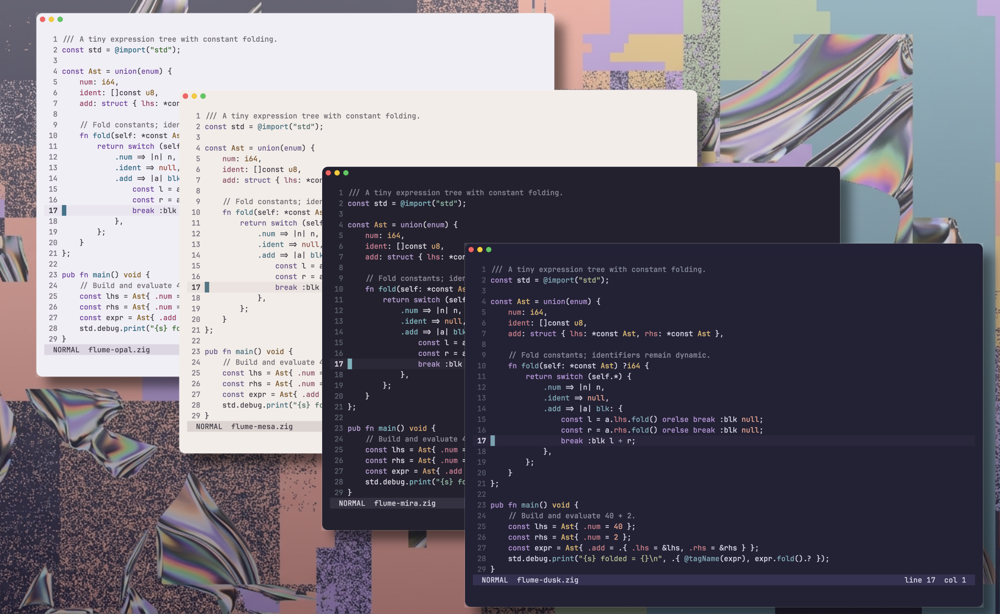

<div align="center">
  
  <p><strong>Organic synthesis. Soft contrast. Resonant code.</strong></p>
</div>

[](docs/showcase.md)

Flume is a Neovim colorscheme with four carefully tuned appearances and matching
themes for ten terminal and developer tools. It favors neutral identifiers,
semantic color, soft surfaces, and enough contrast for long sessions.

| Palette                         | Appearance | Character                                   |
| ------------------------------- | ---------- | ------------------------------------------- |
| [**Dusk**](screenshot-dusk.png) | Dark       | Original quiet violet Flume                 |
| [**Opal**](screenshot-opal.png) | Light      | Vivid inks on cool opalescent paper         |
| [**Mira**](screenshot-mira.png) | Dark       | Technical plum with cyan, teal, and magenta |
| [**Mesa**](screenshot-mesa.png) | Light      | Warm rose-mineral paper                     |

## Why Flume

- Four named palettes with consistent semantic roles across dark and light.
- Tree-sitter, LSP semantic tokens, diagnostics, terminal colors, and popular
  Neovim plugin highlights.
- Matching generated themes for Ghostty, Kitty, Tmux, LSD, OpenCode, Lazygit,
  fzf, Delta, Pi, and Tuxedo.
- Exact role overrides, transparent mode, and optional syntax styles.
- Tested palette contrast, generated-format contracts, and atomic integration
  switching.

Flume takes its visual direction from [Jonathan Zawada's artwork for
Flume](https://zawada.art/work/flume-skin/): organic forms meeting synthetic
surfaces, spectral color, and digital interruption. See the [color
contract](docs/color-system.md) and [generated palette manifest](docs/palette-manifest.md).

## Install

Requires Neovim 0.9+ and true-color support.

### lazy.nvim

```lua
{
    "mitander/flume.nvim",
    lazy = false,
    priority = 1000,
    config = function()
        vim.opt.termguicolors = true
        require("flume").setup({ schema = "dusk" })
    end,
}
```

`setup()` configures and applies Flume once. Do not follow it with another
`:colorscheme` call.

If no Lua options are needed, use a colorscheme entry point instead:

```vim
colorscheme flume-dusk
" Also available: flume-opal, flume-mira, flume-mesa
```

## Configure

```lua
require("flume").setup({
    schema = "dusk", -- dusk, opal, mira, or mesa
    transparent = false,
    terminal_colors = true,
    overrides = {},
    highlights = {},
    styles = {
        comments = {},
        functions = {},
        keywords = {},
        strings = {},
        types = {},
        variables = {},
    },
})
```

### Follow system appearance

Flume does not install an OS watcher. Select a light or dark palette from your
existing appearance hook:

```lua
require("flume").setup({
    schema = vim.o.background == "light" and "opal" or "dusk",
})
```

### Override colors and highlights

```lua
require("flume").setup({
    schema = "opal",
    overrides = {
        syntax_comment = "#7a747a",
        accent = "#5f9cab",
    },
    styles = { comments = { italic = true } },
    highlights = {
        CursorLineNr = { fg = "#ffffff", bold = true },
    },
})
```

Use `:Inspect` or `:highlight GroupName` to identify an exact highlight group.
Runtime saturation transforms are intentionally excluded: exact overrides keep
Neovim and external integrations predictable.

## Integrations

Every palette has a committed artifact for each supported tool. Dusk examples:

| App      | Artifact                            |
| -------- | ----------------------------------- |
| Ghostty  | `extras/ghostty/flume-dusk`         |
| Kitty    | `extras/kitty/flume-dusk.conf`      |
| Tmux     | `extras/tmux/colors-dusk.conf`      |
| LSD      | `extras/lsd/colors-dusk.yaml`       |
| OpenCode | `extras/opencode/flume-dusk.json`   |
| Lazygit  | `extras/lazygit/flume-dusk.yml`     |
| fzf      | `extras/fzf/flume-dusk.opts`        |
| Delta    | `extras/delta/flume-dusk.gitconfig` |
| Pi       | `extras/pi/flume-dusk.json`         |
| Tuxedo   | `extras/tuxedo/flume-dusk.toml`     |

Switch the editor and active external set together:

```vim
:FlumeSync mira
```

Flume can safely install active links for Ghostty, Kitty, OpenCode, Tmux, and
LSD:

```vim
:FlumeInstallExtras
```

The remaining tools have user-specific include locations, so Flume provides
canonical artifacts without guessing destinations. Add the listed artifact
through that tool's own theme or include mechanism. `:FlumeExtras` prints
refusal-safe link instructions only for the five tools with standard paths.

## Commands

| Command                     | Action                                                    |
| --------------------------- | --------------------------------------------------------- |
| `:FlumeReload`              | Reload the editor-local palette                           |
| `:FlumeCompile`             | Regenerate all forty integration artifacts                |
| `:FlumeSync [schema]`       | Apply a palette and activate its integration set          |
| `:FlumeInstallExtras [app]` | Link integrations with safe standard destinations         |
| `:FlumeExtras`              | Show safe-path link instructions for the installable five |
| `:checkhealth flume`        | Check the selected palette and generated files            |
| `:help flume`               | Open the reference manual                                 |

## Development and release evidence

```sh
./scripts/check
nvim --headless --clean -c "lua dofile('scripts/generate-palette-manifest.lua')"
./scripts/screenshot-window.sh dusk
./scripts/screenshot-window.sh opal
./scripts/screenshot-window.sh mira
./scripts/screenshot-window.sh mesa
python3 scripts/preflight-screenshots.py
python3 scripts/compose_showcase.py
```

The deterministic marketing fixture renders valid Zig with representative
syntax and comments, without diagnostics, notifications, Git state, or a
language server. Format contracts and native contact sheets cover integration
and state-heavy surfaces separately. See [showcase production](docs/showcase.md)
for canonical captures and the contact-sheet production recipe.

## Wallpaper

[`background.png`](background.png) is available at its original 1376×768
resolution.

## License

MIT. See [LICENSE](LICENSE).
