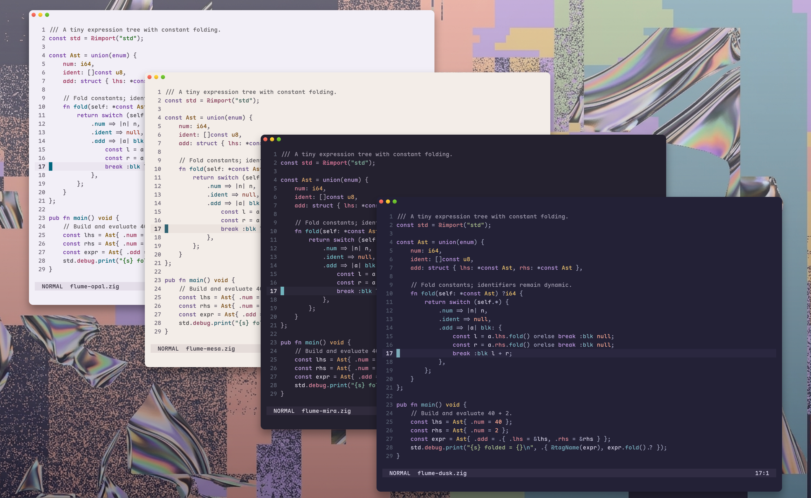

<div align="center">
  
  <p><strong>Organic synthesis. Soft contrast. Resonant code.</strong></p>
</div>

[](docs/showcase.md)

Flume is a Neovim colorscheme with four palettes and matching terminal and
developer-tool themes. Neutral identifiers, semantic color, and soft surfaces
keep the focus on code. Includes Tree-sitter, LSP semantic tokens, diagnostics,
and popular plugin highlights.

## Palettes

Each preview shows the same Zig expression tree with real Tree-sitter highlighting.
Click a palette to browse its languages, diagnostics, completion, LSP, and integrations.

<table>
  <tr>
    <th>Dusk</th>
    <th>Opal</th>
  </tr>
  <tr>
    <td width="50%"><a href="docs/themes/dusk.md"></a></td>
    <td width="50%"><a href="docs/themes/opal.md"></a></td>
  </tr>
  <tr>
    <th>Mira</th>
    <th>Mesa</th>
  </tr>
  <tr>
    <td width="50%"><a href="docs/themes/mira.md"></a></td>
    <td width="50%"><a href="docs/themes/mesa.md"></a></td>
  </tr>
</table>

### Language examples

Compare each language across all four palettes:

- [Go](docs/languages/go.md)
- [Rust](docs/languages/rust.md)
- [Python](docs/languages/python.md)
- [TypeScript/TSX](docs/languages/tsx.md)
- [Zig](docs/languages/zig.md)
- [Elixir](docs/languages/elixir.md)
- [TOML](docs/languages/toml.md)

See the [example sources](docs/showcase.md#code-examples), or browse
[selection, diffs, diagnostics, completion, and LSP coloring](docs/showcase.md#working-state-and-lsp-captures).

## Install

Requires Neovim 0.9+ and true-color support. With lazy.nvim:

```lua
{
    "mitander/flume.nvim",
    lazy = false,
    priority = 1000,
    config = function()
        vim.opt.termguicolors = true
        require("flume").setup({ schema = "dusk" })
    end,
}
```

`setup()` configures and applies Flume. Do not follow it with `:colorscheme`.
Without Lua options, use `colorscheme flume-dusk` instead. The other entry points
are `flume-opal`, `flume-mira`, and `flume-mesa`.

## Configure

Override palette roles, syntax styles, or exact highlight groups:

```lua
require("flume").setup({
    schema = "opal",
    transparent = false,
    overrides = {
        syntax_comment = "#7a747a",
        accent = "#5f9cab",
    },
    styles = { comments = { italic = true } },
    highlights = {
        CursorLineNr = { fg = "#ffffff", bold = true },
    },
})
```

Use `:Inspect` or `:highlight GroupName` to identify a highlight group.
Overrides affect Neovim only; generated themes use canonical palette colors.
See [`:help flume-options`](doc/flume.txt) for all defaults and system-appearance
hooks. Exact roles are listed in the [palette manifest](docs/palette-manifest.md).

## Integrations

- [Lualine](docs/workflows.md#lualine): use `options = { theme = "flume" }`
  in your lualine setup. The named theme follows palette changes.

Matching external-tool themes live in [`extras/`](extras). Setup recipes live in the
[workflow guide](docs/workflows.md#external-tools); native preview status lives
in the [showcase](docs/showcase.md#native-integration-contact-sheets):

- [Ghostty](extras/ghostty/)
- [Kitty](extras/kitty/)
- [Tmux](extras/tmux/)
- [LSD](extras/lsd/)
- [OpenCode](extras/opencode/)
- [Lazygit](extras/lazygit/)
- [fzf](extras/fzf/)
- [Delta](extras/delta/)
- [Pi](extras/pi/)

**Automatic installation:** Ghostty, Kitty, OpenCode, Tmux, and LSD.

```vim
:FlumeInstallExtras
```

**Manual setup:** use the other tools' theme or include mechanisms. Flume does
not guess user-specific destinations. See [`:help flume-extras`](doc/flume.txt)
for artifact paths.

Switch Neovim and the active integration set together:

```vim
:FlumeSync mira
```

Other running Neovim instances follow by default. To remember the synchronized
palette at startup, keep a fallback in your dotfiles:

```lua
require("flume").setup({ schema = "mesa", follow_sync = true })
```

`:FlumeSync mira` records Mira in runtime state, not your Lua configuration.
Set both `follow_sync = false` and `watch_sync = false` for an independent editor.
Active sets live in `stdpath("data")/flume`, outside the plugin checkout. Print
`require("flume").get_sync_dir()` for your exact path. After upgrading, rerun
`:FlumeInstallExtras` and update manual includes; legacy checkout links are forwarded
when possible. External tools need their own reload support. See
[shared workflows](docs/workflows.md) for setup and reload behavior, and the
[semantic export](docs/semantic-export.md) for custom consumers.

## Commands

| Command                     | Action                                                     |
| --------------------------- | ---------------------------------------------------------- |
| `:FlumeReload`              | Reload the editor-local palette                            |
| `:FlumeCompile`             | Regenerate all integration artifacts                       |
| `:FlumeSync [schema]`       | Apply a palette and activate its integration set           |
| `:FlumeInstallExtras [app]` | Link integrations with standard destinations               |
| `:FlumeExtras`              | Show safe link instructions for the five installable tools |
| `:checkhealth flume`        | Check the selected palette and generated files             |
| `:help flume`               | Open the reference manual                                  |

## Development

Set `dev = true` in your local Flume setup to reload on Lua source saves.
Reloads preserve the editor's current palette and do not synchronize external tools.

Run `./scripts/check` for tests, local links, and source checks. The check script
requires Neovim and Python 3.11+.

- [Color system](docs/color-system.md): roles, contrast targets, and mapping rules.
- [Integration review](docs/integration-review.md): visual previews, contrast measurements, and before/after reports.
- [Showcase production](docs/showcase.md): captures and native integration evidence.
- [Changelog](CHANGELOG.md): release history.

Flume's visual direction draws on [Jonathan Zawada's artwork for
Flume](https://zawada.art/work/flume-skin/). A [wallpaper](assets/background.png) is
available at 1376×768.

## License

MIT. See [LICENSE](LICENSE).
