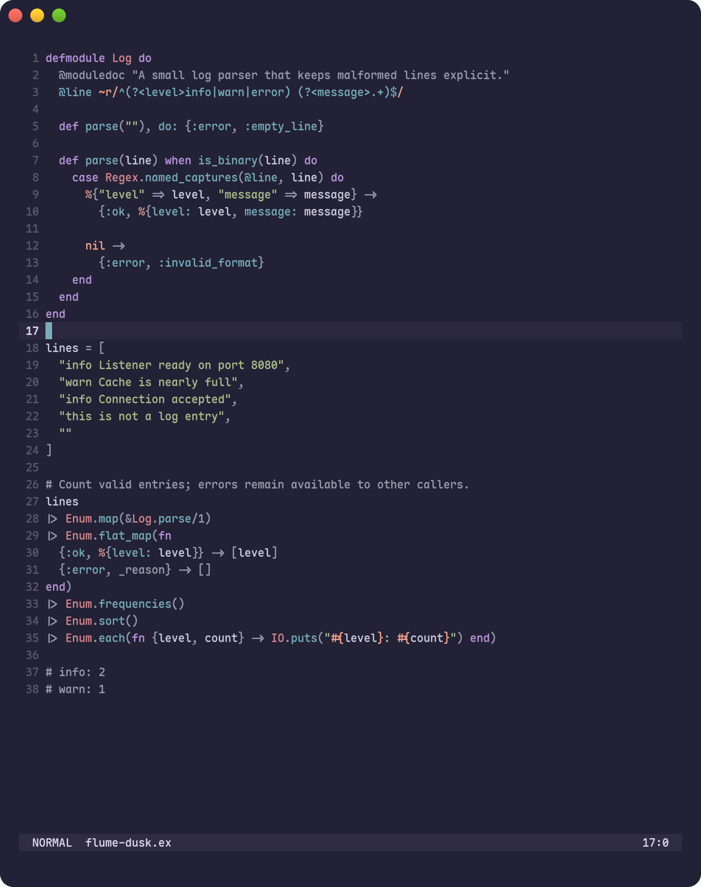
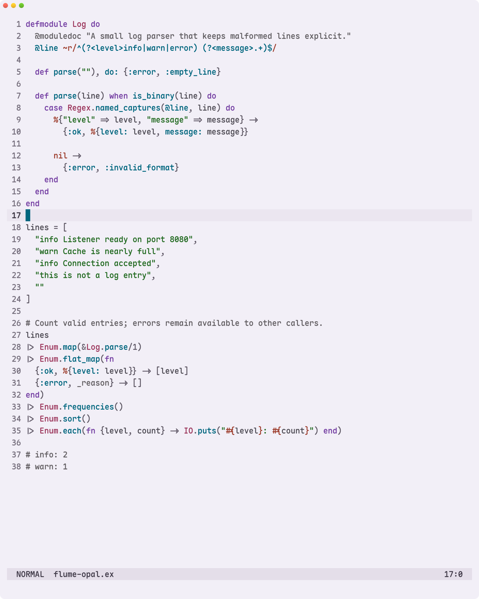

# Elixir examples

The same Elixir source and Tree-sitter runtime in all four themes.
[Source and capture details](../showcase.md#code-examples).

[Dusk](#dusk) · [Opal](#opal) · [Mira](#mira) · [Mesa](#mesa) ·
[All galleries](../gallery.md)

## Dusk

[More Dusk examples](../themes/dusk.md#elixir)

## Opal

[More Opal examples](../themes/opal.md#elixir)

## Mira

[More Mira examples](../themes/mira.md#elixir)

## Mesa

[More Mesa examples](../themes/mesa.md#elixir)

