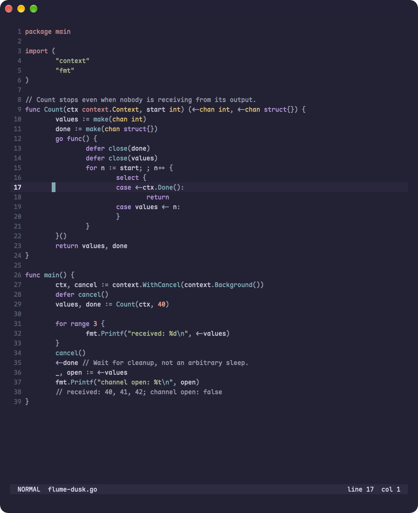
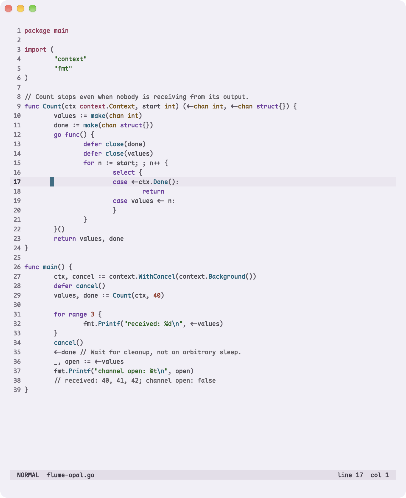

# Go examples

The same Go source and Tree-sitter runtime in all four themes.
[Source and capture details](../showcase.md#code-examples).

[Dusk](#dusk) · [Opal](#opal) · [Mira](#mira) · [Mesa](#mesa) ·
[All galleries](../showcase.md#individual-language-captures)

## Dusk

[More Dusk examples](../themes/dusk.md#go)

## Opal

[More Opal examples](../themes/opal.md#go)

## Mira

[More Mira examples](../themes/mira.md#go)

## Mesa

[More Mesa examples](../themes/mesa.md#go)

