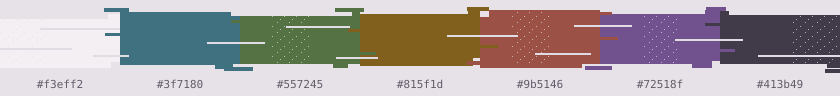

# Light scheme direction

> Design exploration only. Flume currently ships one dark variant.

A light Flume should feel like the same material under daylight, not an inverted dark palette. The direction is **violet paper with mineral ink**: a warm, faintly purple base; charcoal text; and the existing smoke-blue, moss, resin, coral, rose, and spectral-violet families shifted darker for legibility.

## Seed palette

| Role | Value | Intent |
| --- | --- | --- |
| Background | `#f3eff2` | Warm violet paper, never pure white |
| Surface | `#ece6ec` | Quiet raised UI |
| Surface strong | `#dfd7e1` | Status lines and active controls |
| Primary text | `#413b49` | Charcoal violet |
| Secondary text | `#554e5d` | Softer UI text |
| Muted text/comments | `#706878` | Visible without dominating |
| Border | `#8b8491` | State-bearing boundaries at roughly 3:1 |
| Smoke blue | `#3f7180` | Functions, constants, information |
| Moss | `#557245` | Strings and success |
| Resin | `#815f1d` | Types, matches, warnings |
| Coral | `#9b5146` | Literals and booleans |
| Spectral violet | `#72518f` | Keywords |
| Dusty rose | `#934d5b` | Properties, namespaces, errors |
| On accent | `#fbf8fa` | Text on filled semantic colors |

The primary syntax accents above meet or exceed 4.5:1 against the proposed background. Decorative surfaces and guides may be quieter, but controls and meaningful boundaries should target 3:1.

## What should remain recognizably Flume

- Neutral identifiers carry the composition; color does not flood every token.
- Blue-gray anchors functions and navigation.
- Resin marks types and search; violet marks control flow.
- Moss, coral, and dusty rose provide the organic warmth.
- Surfaces remain close together, with hierarchy created by small luminance steps.
- Glitch and spectral references stay in the presentation, not at the expense of editor clarity.

## Architecture required before release

1. Resolve `dark` or `light` before applying user overrides.
2. Keep one shared highlight map driven by semantic roles.
3. Give both variants identical palette keys.
4. Set `vim.o.background` from variant metadata.
5. Keep `colorscheme flume` dark-compatible and add an explicit light entry point.
6. Name generated extras by variant instead of compiling whichever editor palette is active.
7. Run the same contrast and runtime contracts against both palettes.

A light variant should ship only after a manual code screenshot review in addition to automated contrast checks.
