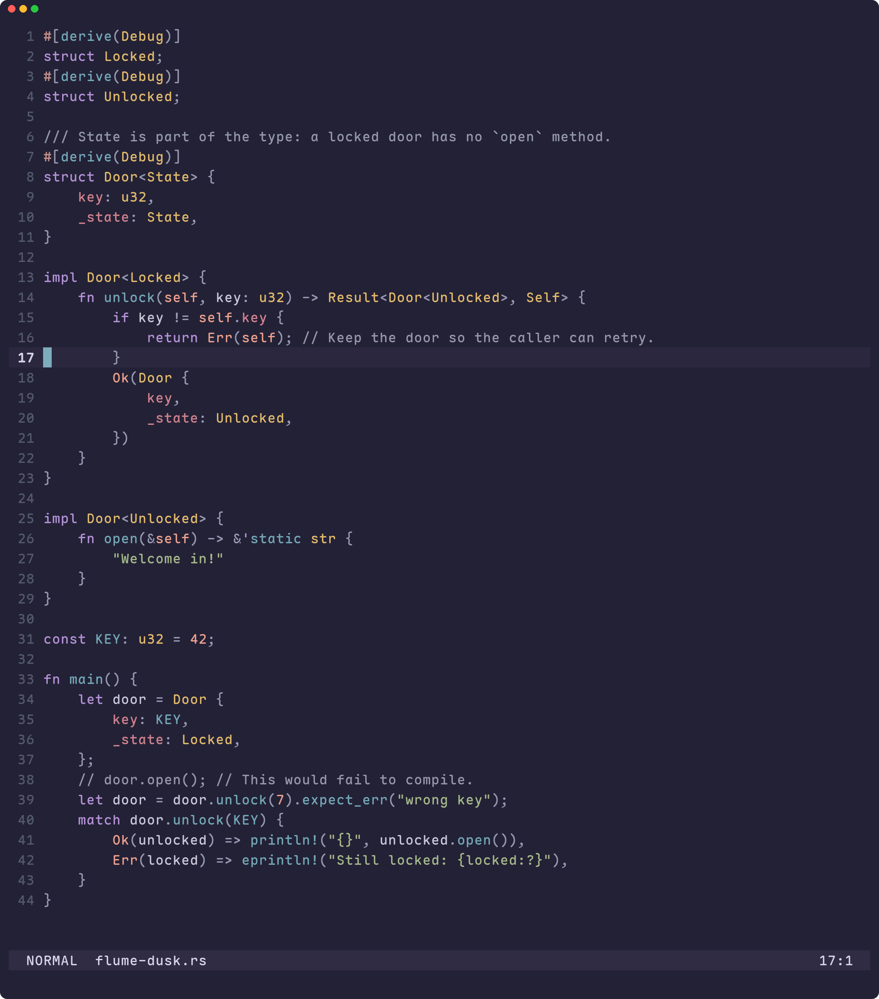
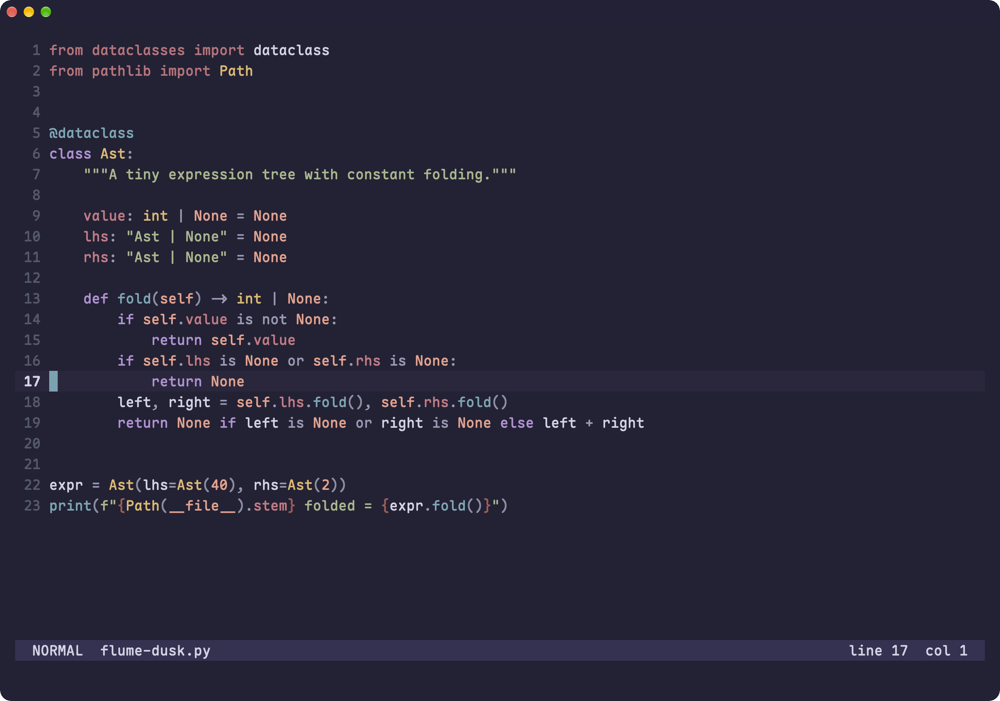
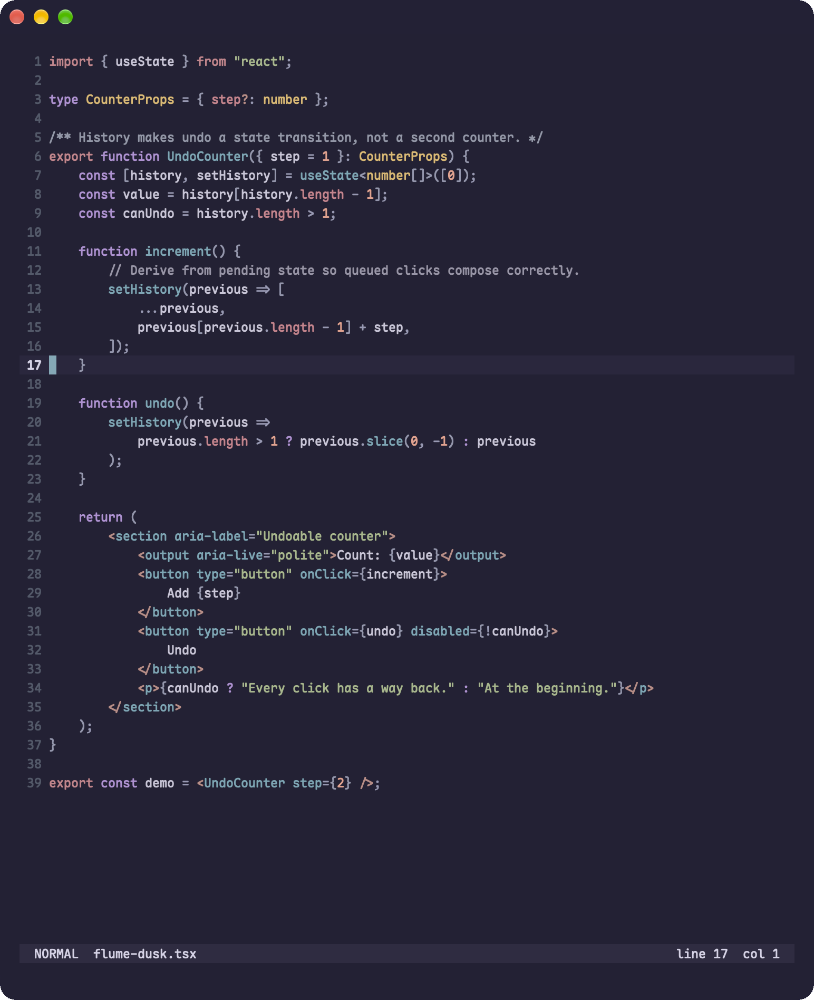
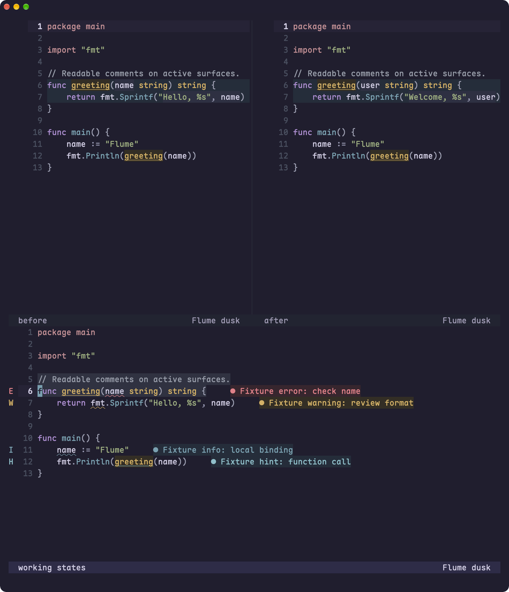
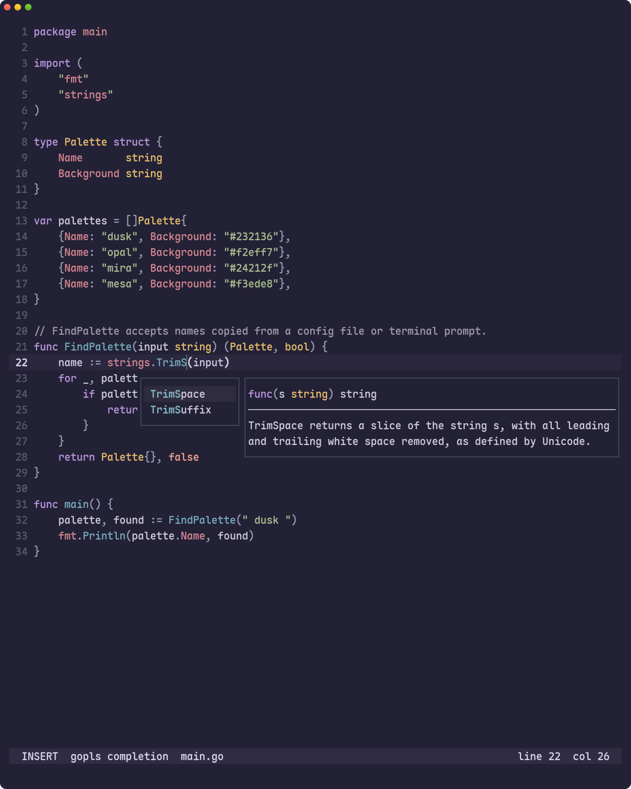
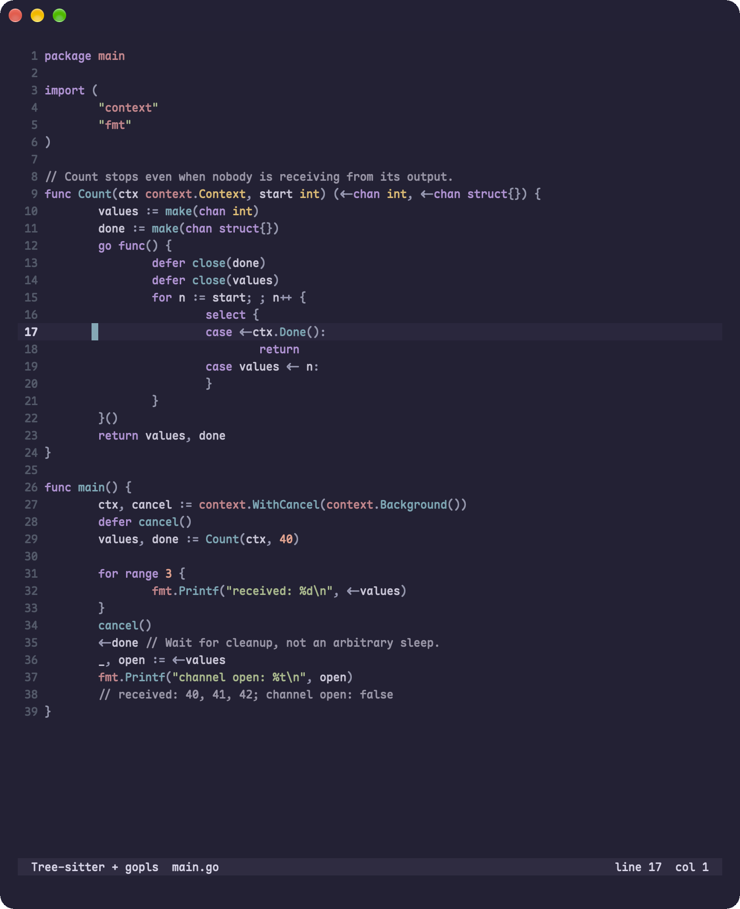
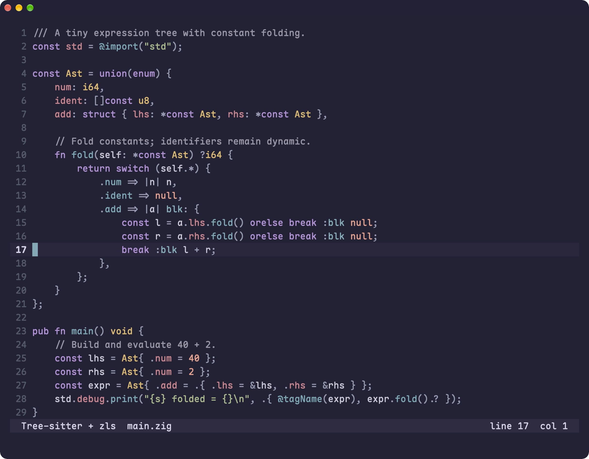

# Dusk examples

Dark palette with a violet canvas. [All galleries](../gallery.md).

[Go](#go) · [Rust](#rust) · [Python](#python) · [TypeScript](#typescript) ·
[Zig](#zig) · [Elixir](#elixir) · [TOML](#toml) ·
[Diagnostics and working states](#diagnostics-and-working-states) ·
[Completion](#completion) · [LSP](#lsp) · [Integrations](#integrations)

## Go

[Compare all themes](../languages/go.md#dusk)

## Rust

[Compare all themes](../languages/rust.md#dusk)

## Python

[Compare all themes](../languages/python.md#dusk)

## TypeScript

[Compare all themes](../languages/tsx.md#dusk)

## Zig

[Compare all themes](../languages/zig.md#dusk)

## Elixir

[Compare all themes](../languages/elixir.md#dusk)

## TOML

[Compare all themes](../languages/toml.md#dusk)

## Diagnostics and working states

Real diff panes, changed words, search matches, selection, and fixture diagnostics
with signs, underlines, and virtual text.

## Completion

Native completion menu alongside the same diff and diagnostic fixture.

## LSP

These captures combine Tree-sitter with semantic tokens from gopls and ZLS.
Diagnostics are suppressed here to isolate provider coloring.
[Capture provenance and supported versions](../showcase.md#working-state-and-lsp-captures).

### Go with gopls

### Zig with ZLS

## Integrations

[Setup recipes](../workflows.md#external-tools) · [Lualine setup](../workflows.md#lualine).
External-app screenshots aren't available yet; the images above show Neovim only.
Matching theme files are listed below.

| Integration | Dusk configuration |
| --- | --- |
| Ghostty | [Theme](../../extras/ghostty/flume-dusk) |
| Kitty | [Theme](../../extras/kitty/flume-dusk.conf) |
| Tmux | [Theme](../../extras/tmux/colors-dusk.conf) |
| LSD | [Colors](../../extras/lsd/colors-dusk.yaml) |
| OpenCode | [Theme](../../extras/opencode/flume-dusk.json) |
| Lazygit | [Theme](../../extras/lazygit/flume-dusk.yml) |
| fzf | [Options](../../extras/fzf/flume-dusk.opts) |
| Delta | [Configuration](../../extras/delta/flume-dusk.gitconfig) |
| Pi | [Theme](../../extras/pi/flume-dusk.json) |
